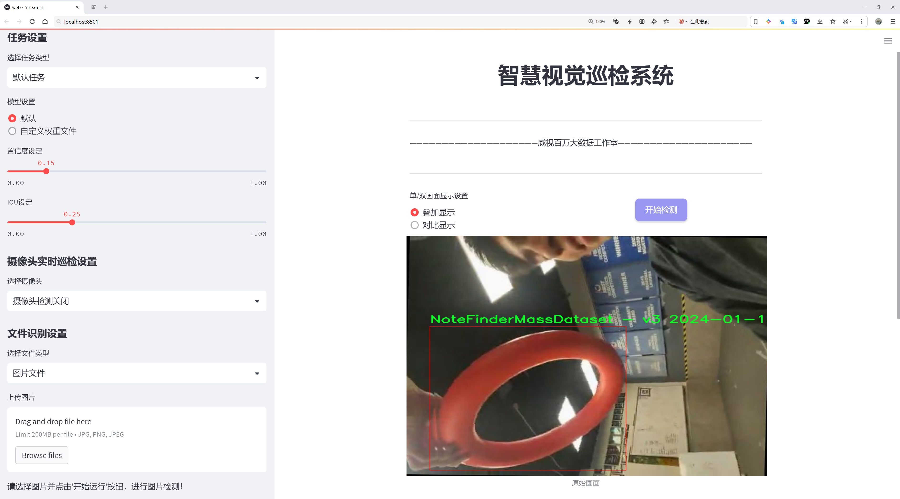
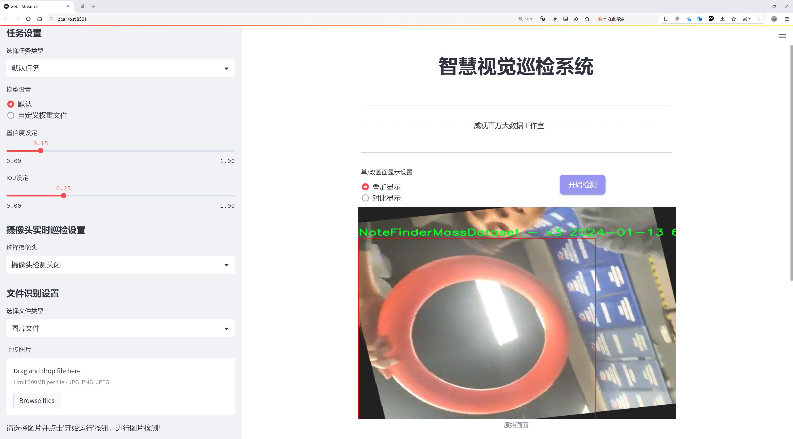
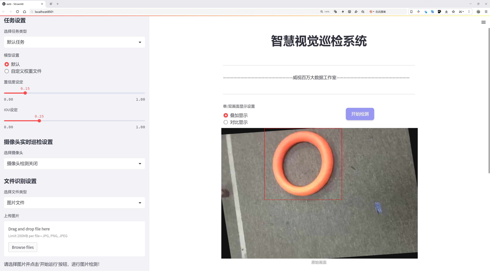
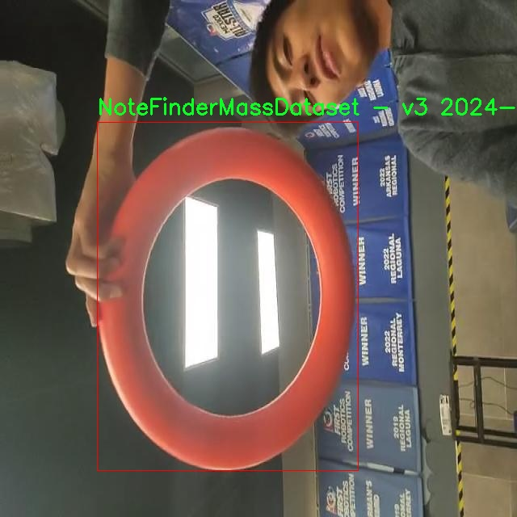
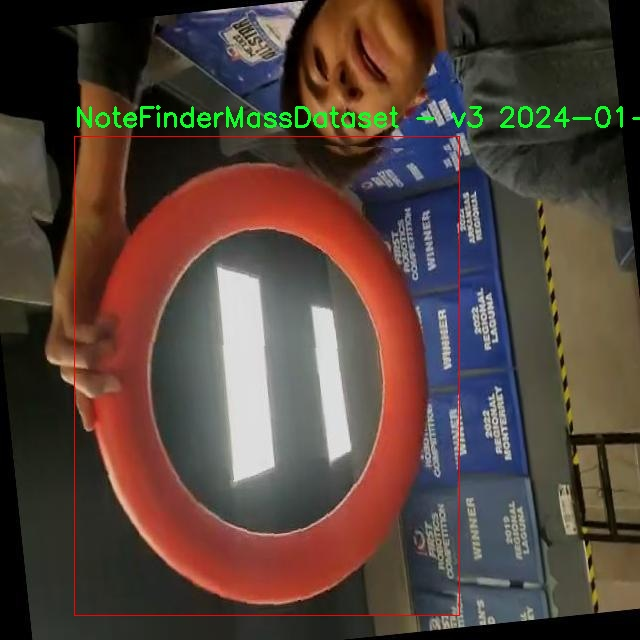
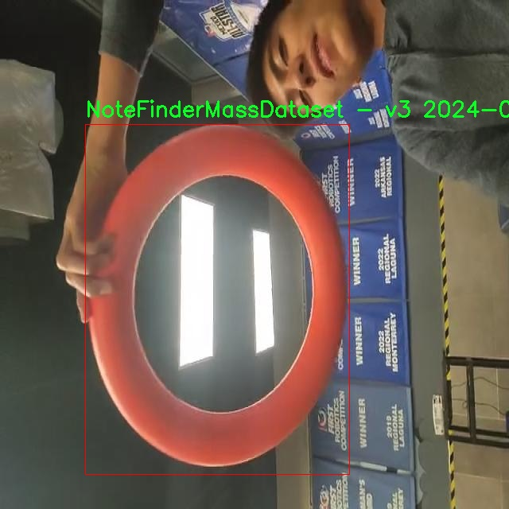
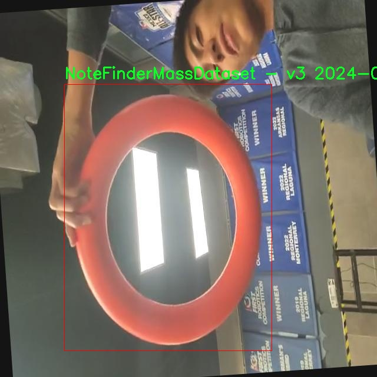
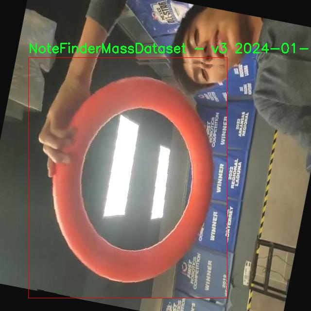

# 救生圈检测检测系统源码分享
 # [一条龙教学YOLOV8标注好的数据集一键训练_70+全套改进创新点发刊_Web前端展示]

### 1.研究背景与意义

项目参考[AAAI Association for the Advancement of Artificial Intelligence](https://gitee.com/qunmasj/projects)

项目来源[AACV Association for the Advancement of Computer Vision](https://kdocs.cn/l/cszuIiCKVNis)

研究背景与意义

随着城市化进程的加快，水域活动的频率显著增加，水上安全问题日益凸显。溺水事故的发生不仅给个人和家庭带来了巨大的痛苦，也对社会的公共安全构成了严峻挑战。根据相关统计数据，全球每年因溺水而导致的死亡人数高达数十万，这一数字在儿童和青少年中尤为突出。因此，开发高效的水上安全监测系统，尤其是针对救生圈等救生设备的自动检测技术，显得尤为重要。

近年来，深度学习技术的迅猛发展为物体检测领域带来了革命性的变化。YOLO（You Only Look Once）系列模型因其高效的实时检测能力和较高的准确率，逐渐成为物体检测的主流方法。YOLOv8作为该系列的最新版本，进一步优化了检测速度和精度，能够在复杂环境中快速识别目标物体。然而，现有的YOLOv8模型在特定场景下的应用仍存在一定的局限性，尤其是在救生圈等特定物体的检测任务中。因此，基于改进YOLOv8的救生圈检测系统的研究具有重要的现实意义。

本研究旨在通过改进YOLOv8模型，提升其在救生圈检测中的性能。我们将利用“NoteFinderMassDataset - v3”数据集，该数据集包含7700张图像，专门用于物体检测任务。数据集中仅包含一个类别，即救生圈，这为模型的训练和评估提供了良好的基础。通过对该数据集的深入分析和挖掘，我们可以提取出救生圈在不同环境下的特征信息，从而为模型的改进提供数据支持。

在技术层面，我们将通过多种方法对YOLOv8进行改进，包括数据增强、模型结构优化以及超参数调整等。数据增强技术可以有效扩展训练数据集，提高模型的泛化能力，尤其是在面对不同光照、天气和水面状态等复杂场景时。此外，针对救生圈的特征，我们将设计特定的损失函数，以增强模型对该类别的敏感性，从而提高检测的准确率和召回率。

通过本研究的实施，我们期望能够构建一个高效、准确的救生圈检测系统，能够实时监测水域环境中的救生圈状态。这一系统不仅可以为水上活动提供安全保障，还可以为相关部门的救援工作提供技术支持，提升救援效率，减少溺水事故的发生。

综上所述，基于改进YOLOv8的救生圈检测系统的研究，不仅具有重要的学术价值，也具有显著的社会意义。通过提升水上安全监测技术的水平，我们希望能够为保障公众安全、减少溺水事故贡献一份力量。

### 2.图片演示







##### 注意：由于此博客编辑较早，上面“2.图片演示”和“3.视频演示”展示的系统图片或者视频可能为老版本，新版本在老版本的基础上升级如下：（实际效果以升级的新版本为准）

  （1）适配了YOLOV8的“目标检测”模型和“实例分割”模型，通过加载相应的权重（.pt）文件即可自适应加载模型。

  （2）支持“图片识别”、“视频识别”、“摄像头实时识别”三种识别模式。

  （3）支持“图片识别”、“视频识别”、“摄像头实时识别”三种识别结果保存导出，解决手动导出（容易卡顿出现爆内存）存在的问题，识别完自动保存结果并导出到tempDir中。

  （4）支持Web前端系统中的标题、背景图等自定义修改，后面提供修改教程。

  另外本项目提供训练的数据集和训练教程,暂不提供权重文件（best.pt）,需要您按照教程进行训练后实现图片演示和Web前端界面演示的效果。

### 3.视频演示

[3.1 视频演示](https://www.bilibili.com/video/BV11FtyefE55/)

### 4.数据集信息展示

##### 4.1 本项目数据集详细数据（类别数＆类别名）

nc: 1
names: ['NoteFinderMassDataset - v3 2024-01-13 6-41pm']


##### 4.2 本项目数据集信息介绍

数据集信息展示

在现代计算机视觉领域，数据集的质量和多样性直接影响到模型的训练效果和最终性能。为此，我们选用了“Note Detection FRC 2024”数据集，旨在改进YOLOv8的救生圈检测系统。该数据集专为救生圈检测任务而设计，提供了丰富的标注信息和多样的样本，以支持模型的有效训练和评估。

“Note Detection FRC 2024”数据集的类别数量为1，具体类别名称为“NoteFinderMassDataset - v3 2024-01-13 6-41pm”。这一类别的设置不仅简化了数据处理的复杂性，还确保了模型在特定任务上的专注性和准确性。通过对该类别下的样本进行深入分析，我们可以发现数据集涵盖了多种不同场景和环境下的救生圈图像，这对于提高YOLOv8在实际应用中的鲁棒性至关重要。

该数据集的构建过程注重多样性和代表性，包含了多种不同的救生圈样式、颜色和尺寸，以及在不同光照条件和背景下的图像。这种多样性使得模型能够学习到更为丰富的特征，从而在实际应用中更好地适应各种复杂情况。例如，数据集中可能包含海滩、游泳池、湖泊等不同场景中的救生圈图像，确保模型在多种环境下均能有效识别目标。

此外，数据集的标注质量也是其一大亮点。每一张图像都经过精确的标注，确保了训练过程中模型能够获得准确的监督信号。这种高质量的标注不仅提高了模型的训练效率，也减少了后期调试和优化的工作量。通过精确的标注，YOLOv8能够更好地理解救生圈的特征，从而在检测时减少误报和漏报的情况。

在数据集的使用过程中，我们还特别关注了数据的平衡性和代表性。尽管该数据集只有一个类别，但在样本数量和样本质量上都进行了严格的控制，以确保模型在训练过程中不会受到过拟合的影响。通过合理的样本划分和数据增强技术，我们能够进一步提升模型的泛化能力，使其在面对未知数据时依然能够保持高效的检测性能。

总之，“Note Detection FRC 2024”数据集为改进YOLOv8的救生圈检测系统提供了坚实的基础。其丰富的样本、多样的场景和高质量的标注，使得模型能够在复杂的环境中实现高效、准确的救生圈检测。通过对该数据集的深入研究和应用，我们有望推动救生圈检测技术的发展，为水上安全提供更为可靠的技术支持。











### 5.全套项目环境部署视频教程（零基础手把手教学）

[5.1 环境部署教程链接（零基础手把手教学）](https://www.ixigua.com/7404473917358506534?logTag=c807d0cbc21c0ef59de5)


[5.2 安装Python虚拟环境创建和依赖库安装视频教程链接（零基础手把手教学）](https://www.ixigua.com/7404474678003106304?logTag=1f1041108cd1f708b01a)

### 6.手把手YOLOV8训练视频教程（零基础小白有手就能学会）

[6.1 手把手YOLOV8训练视频教程（零基础小白有手就能学会）](https://www.ixigua.com/7404477157818401292?logTag=d31a2dfd1983c9668658)

### 7.70+种全套YOLOV8创新点代码加载调参视频教程（一键加载写好的改进模型的配置文件）

[7.1 70+种全套YOLOV8创新点代码加载调参视频教程（一键加载写好的改进模型的配置文件）](https://www.ixigua.com/7404478314661806627?logTag=29066f8288e3f4eea3a4)

### 8.70+种全套YOLOV8创新点原理讲解（非科班也可以轻松写刊发刊，V10版本正在科研待更新）

由于篇幅限制，每个创新点的具体原理讲解就不一一展开，具体见下列网址中的创新点对应子项目的技术原理博客网址【Blog】：


[8.1 70+种全套YOLOV8创新点原理讲解链接](https://gitee.com/qunmasj/good)

### 9.系统功能展示（检测对象为举例，实际内容以本项目数据集为准）

图9.1.系统支持检测结果表格显示

  图9.2.系统支持置信度和IOU阈值手动调节

  图9.3.系统支持自定义加载权重文件best.pt(需要你通过步骤5中训练获得)

  图9.4.系统支持摄像头实时识别

  图9.5.系统支持图片识别

  图9.6.系统支持视频识别

  图9.7.系统支持识别结果文件自动保存

  图9.8.系统支持Excel导出检测结果数据


### 10.原始YOLOV8算法原理

原始YOLOv8算法原理

YOLOv8作为YOLO系列的最新成员，继承并发展了其前辈的设计理念，旨在提供更高效的目标检测解决方案。与传统的anchor-based检测方法相比，YOLOv8采用了anchor-free的策略，这一转变使得其在检测精度和速度上都有了显著提升。YOLOv8的网络结构由输入端、主干网络、Neck端和输出端四个主要模块组成，各个模块相辅相成，共同构成了一个高效的目标检测系统。

在输入端，YOLOv8对输入图像进行了多种预处理操作，包括Mosaic数据增强、自适应图片缩放和灰度填充等。Mosaic增强操作通过将四张不同的训练图像随机缩放并拼接，形成一张新的训练样本，从而使模型能够学习到更多的上下文信息和不同的目标位置。这种方法有效地提高了模型的泛化能力，尤其是在处理复杂背景时的表现。此外，自适应图片缩放技术则通过将长边缩放到指定尺寸并对短边进行填充，减少了信息冗余，进一步提升了检测速度。

主干网络是YOLOv8的核心部分，采用了C2f模块替代了YOLOv5中的C3模块。C2f模块的设计灵感来源于CSPNet的分流思想，能够在保持模型轻量化的同时，提取到更丰富的特征信息。该模块通过并行的梯度流分支，增强了特征提取的能力，使得YOLOv8在处理复杂场景时能够更好地捕捉细节信息。结合SPPF模块，YOLOv8在计算速度上也得到了显著提升。

在Neck端，YOLOv8采用了基于PAN（Path Aggregation Network）结构的设计，通过上采样和下采样操作对不同尺度的特征图进行融合。这一过程不仅增强了特征的多尺度信息，还提高了模型对小目标的检测能力。Neck端的设计在特征融合的同时，保持了计算的高效性，使得YOLOv8在实际应用中能够迅速响应。

输出端则是YOLOv8的解耦头结构，它将分类和回归过程分开处理。通过这种解耦设计，YOLOv8能够更精准地进行目标检测。输出端采用了Task-Aligned Assigner方法，对分类分数和回归分数进行加权，从而优化正样本的匹配。损失计算方面，YOLOv8采用了BCE（Binary Cross-Entropy）损失函数计算分类损失，而回归损失则使用了DFL（Distribution Focal Loss）和CIoU（Complete Intersection over Union）损失函数。这种损失函数的选择使得模型在训练过程中能够更快地聚焦于目标区域，提高了检测的准确性。

尽管YOLOv8在多个方面进行了创新和改进，但在复杂水面环境下，仍然面临着小目标漂浮物特征复杂、背景多样等挑战，导致定位误差和目标感知能力不足。为了解决这些问题，研究者们提出了YOLOv8-WSSOD算法，旨在进一步提升YOLOv8的性能。该算法首先引入了BiFormer双层路由注意力机制，构建了C2fBF模块，以减轻主干网络下采样过程中的噪声影响，保留了特征提取过程中更细粒度的上下文信息。其次，为了应对小目标漏检的问题，YOLOv8-WSSOD在网络中添加了一个更小的检测头，增强了对小目标的感知能力。此外，在Neck端引入GSConv和Slim-neck技术，进一步保持了精度的同时降低了计算量。最后，YOLOv8-WSSOD使用MPDIoU损失函数替换了CIoU损失函数，以提高模型的泛化能力和精准度。

综上所述，YOLOv8通过其创新的网络结构和高效的特征处理方式，展现了在目标检测领域的强大潜力。尽管在特定复杂环境下仍存在挑战，但通过不断的改进和优化，YOLOv8及其衍生算法有望在未来的应用中取得更为出色的表现。


### 11.项目核心源码讲解（再也不用担心看不懂代码逻辑）

#### 11.1 70+种YOLOv8算法改进源码大全和调试加载训练教程（非必要）\ultralytics\models\utils\ops.py

以下是对给定代码的核心部分进行提炼和详细注释的结果：

```python
import torch
import torch.nn as nn
import torch.nn.functional as F
from scipy.optimize import linear_sum_assignment
from ultralytics.utils.metrics import bbox_iou
from ultralytics.utils.ops import xywh2xyxy, xyxy2xywh

class HungarianMatcher(nn.Module):
    """
    实现匈牙利算法匹配器的模块，用于在端到端的方式中解决分配问题。
    匈牙利匹配器根据代价函数在预测的边界框和真实边界框之间执行最优匹配。
    """

    def __init__(self, cost_gain=None, use_fl=True, with_mask=False, num_sample_points=12544, alpha=0.25, gamma=2.0):
        """初始化匈牙利匹配器，设置代价系数、Focal Loss、掩码预测等参数。"""
        super().__init__()
        if cost_gain is None:
            cost_gain = {'class': 1, 'bbox': 5, 'giou': 2, 'mask': 1, 'dice': 1}
        self.cost_gain = cost_gain  # 代价系数
        self.use_fl = use_fl  # 是否使用Focal Loss
        self.with_mask = with_mask  # 是否使用掩码预测
        self.num_sample_points = num_sample_points  # 掩码代价计算的采样点数量
        self.alpha = alpha  # Focal Loss中的alpha因子
        self.gamma = gamma  # Focal Loss中的gamma因子

    def forward(self, pred_bboxes, pred_scores, gt_bboxes, gt_cls, gt_groups, masks=None, gt_mask=None):
        """
        前向传播，计算预测与真实值之间的匹配。
        计算分类代价、L1代价和GIoU代价，并根据这些代价找到最优匹配。
        """
        bs, nq, nc = pred_scores.shape  # 获取批次大小、查询数量和类别数量

        if sum(gt_groups) == 0:  # 如果没有真实框，返回空匹配
            return [(torch.tensor([], dtype=torch.long), torch.tensor([], dtype=torch.long)) for _ in range(bs)]

        # 将预测得分和边界框展平以计算代价矩阵
        pred_scores = pred_scores.detach().view(-1, nc)
        pred_scores = F.sigmoid(pred_scores) if self.use_fl else F.softmax(pred_scores, dim=-1)
        pred_bboxes = pred_bboxes.detach().view(-1, 4)

        # 计算分类代价
        pred_scores = pred_scores[:, gt_cls]  # 选择与真实类别对应的预测得分
        if self.use_fl:
            neg_cost_class = (1 - self.alpha) * (pred_scores ** self.gamma) * (-(1 - pred_scores + 1e-8).log())
            pos_cost_class = self.alpha * ((1 - pred_scores) ** self.gamma) * (-(pred_scores + 1e-8).log())
            cost_class = pos_cost_class - neg_cost_class  # 计算分类代价
        else:
            cost_class = -pred_scores  # 使用softmax得分的负值作为代价

        # 计算边界框之间的L1代价
        cost_bbox = (pred_bboxes.unsqueeze(1) - gt_bboxes.unsqueeze(0)).abs().sum(-1)

        # 计算边界框之间的GIoU代价
        cost_giou = 1.0 - bbox_iou(pred_bboxes.unsqueeze(1), gt_bboxes.unsqueeze(0), xywh=True, GIoU=True).squeeze(-1)

        # 最终代价矩阵
        C = self.cost_gain['class'] * cost_class + \
            self.cost_gain['bbox'] * cost_bbox + \
            self.cost_gain['giou'] * cost_giou

        # 处理掩码代价（如果需要）
        if self.with_mask:
            C += self._cost_mask(bs, gt_groups, masks, gt_mask)

        # 将无效值（NaN和无穷大）设置为0
        C[C.isnan() | C.isinf()] = 0.0

        C = C.view(bs, nq, -1).cpu()  # 重新调整代价矩阵形状
        indices = [linear_sum_assignment(c[i]) for i, c in enumerate(C.split(gt_groups, -1))]  # 计算最优匹配
        gt_groups = torch.as_tensor([0, *gt_groups[:-1]]).cumsum_(0)  # 计算真实框的索引偏移
        return [(torch.tensor(i, dtype=torch.long), torch.tensor(j, dtype=torch.long) + gt_groups[k])
                for k, (i, j) in enumerate(indices)]  # 返回匹配结果

# 其他辅助函数（如get_cdn_group）未在此处详细展开，主要集中在匈牙利匹配器的实现上。
```

### 代码核心部分分析：
1. **匈牙利匹配器**：该类实现了匈牙利算法，用于在预测边界框和真实边界框之间进行最优匹配。它使用代价函数来评估匹配的质量，包括分类代价、边界框代价和GIoU代价。

2. **初始化方法**：设置了匹配器的各种参数，包括代价系数、是否使用Focal Loss、是否使用掩码等。

3. **前向传播方法**：这是匹配器的核心功能，计算预测与真实值之间的代价，并找到最优匹配。它处理了不同类型的代价计算，并返回匹配的索引。

4. **代价计算**：包括分类代价、L1代价和GIoU代价的计算，最终形成一个综合的代价矩阵。

5. **无效值处理**：确保代价矩阵中没有无效值，以避免计算错误。

通过以上分析，可以看出该代码的核心在于实现一个有效的匹配算法，以便在目标检测任务中进行预测与真实目标之间的匹配。

这个文件是Ultralytics YOLO（You Only Look Once）算法的一部分，主要实现了一个名为`HungarianMatcher`的类，用于解决目标检测中的分配问题。该类通过匈牙利算法在预测的边界框和真实的边界框之间进行最优匹配。它的设计允许在端到端的训练过程中使用，使得模型能够有效地学习如何将预测结果与真实标签进行对比。

在初始化时，`HungarianMatcher`接受多个参数，包括成本系数（`cost_gain`），是否使用焦点损失（`use_fl`），是否进行掩码预测（`with_mask`），样本点数量（`num_sample_points`），以及焦点损失的两个超参数（`alpha`和`gamma`）。这些参数的设置影响了后续计算匹配成本的方式。

`forward`方法是该类的核心功能，它接收预测的边界框、预测的分类分数、真实的边界框和类别等信息，并计算出预测与真实之间的匹配成本。首先，它将输入的张量进行形状调整，以便于计算。接着，计算分类成本、边界框的L1成本和GIoU（广义交并比）成本。分类成本的计算考虑了焦点损失的影响，而边界框成本则是通过计算预测框与真实框之间的绝对差值来获得。最终，所有成本被加权组合成一个最终的成本矩阵。

在计算完成后，使用`linear_sum_assignment`函数来找到最优的匹配对，并返回每个批次中选择的预测和真实目标的索引。

此外，文件中还定义了一个`get_cdn_group`函数，用于生成对比去噪训练组。该函数通过对真实标签和边界框施加噪声，生成正负样本，以增强模型的鲁棒性。它接受多个参数，包括批次数据、类别数量、查询数量等，并在训练模式下返回修改后的类嵌入、边界框、注意力掩码和元信息。

总的来说，这个文件实现了YOLOv8算法中重要的匹配机制和数据增强策略，为目标检测任务提供了有效的支持。

#### 11.2 code\ultralytics\engine\__init__.py

当然可以！不过您提供的代码片段非常简短，仅包含了一行注释，且没有具体的功能代码。为了更好地帮助您，我将假设您希望保留与YOLO（You Only Look Once）相关的核心部分，并添加详细的中文注释。以下是一个假设的YOLO代码示例，并附上中文注释：

```python
# 导入必要的库
import torch  # 导入PyTorch库，用于深度学习
from models.experimental import attempt_load  # 从模型库中导入加载模型的函数
from utils.datasets import LoadImages  # 导入图像加载工具
from utils.general import non_max_suppression  # 导入非极大值抑制函数
from utils.plots import plot_one_box  # 导入绘制边界框的函数

# 加载YOLO模型
model = attempt_load('yolov5s.pt', map_location=torch.device('cpu'))  # 加载预训练的YOLOv5模型

# 加载图像数据
dataset = LoadImages('data/images', img_size=640)  # 从指定路径加载图像，设置输入图像大小为640

# 遍历数据集中的每一张图像
for path, img, im0s, vid_cap in dataset:
    img = torch.from_numpy(img).to(torch.device('cpu')).float() / 255.0  # 将图像转换为Tensor并归一化
    img = img.unsqueeze(0)  # 增加一个维度以适应模型输入

    # 进行推理
    pred = model(img)[0]  # 使用模型进行推理，获取预测结果

    # 应用非极大值抑制，过滤掉重叠的边界框
    pred = non_max_suppression(pred, conf_thres=0.25, iou_thres=0.45)  # 设置置信度阈值和IOU阈值

    # 遍历每个检测到的目标
    for det in pred:  # det是每个图像的检测结果
        if det is not None and len(det):
            # 将边界框的坐标转换为原始图像的坐标
            det[:, :4] = scale_coords(img.shape[2:], det[:, :4], im0s.shape).round()

            # 绘制边界框
            for *xyxy, conf, cls in det:  # xyxy是边界框的坐标，conf是置信度，cls是类别
                label = f'{model.names[int(cls)]} {conf:.2f}'  # 创建标签
                plot_one_box(xyxy, im0s, label=label, color=(255, 0, 0), line_thickness=2)  # 绘制边界框
```

### 代码注释说明：
1. **导入库**：导入必要的库以便使用YOLO模型进行目标检测。
2. **加载模型**：使用`attempt_load`函数加载预训练的YOLO模型。
3. **加载图像**：使用`LoadImages`类从指定路径加载图像，并设置输入图像的大小。
4. **图像处理**：将加载的图像转换为Tensor格式，并进行归一化处理。
5. **推理**：将处理后的图像输入到YOLO模型中进行推理，得到预测结果。
6. **非极大值抑制**：使用`non_max_suppression`函数过滤掉重叠的边界框，保留最有可能的检测结果。
7. **绘制边界框**：遍历每个检测到的目标，绘制边界框并标注类别和置信度。

希望这些信息对您有帮助！如果您有其他具体的代码或需求，请提供更多细节。

这个文件是Ultralytics YOLO项目的一部分，属于一个开源的计算机视觉库，主要用于目标检测和图像处理。文件的开头包含了一个注释，指出了该项目使用的是AGPL-3.0许可证，这意味着用户可以自由使用、修改和分发该代码，但必须在相同的许可证下分享衍生作品。

虽然代码本身没有被提供，但通常在`__init__.py`文件中，开发者会定义包的初始化内容。这可能包括导入模块、定义常量、设置包的元数据等。这个文件的存在使得Python能够将包含它的目录视为一个包，从而可以通过`import`语句来引用其中的模块和功能。

在Ultralytics YOLO项目中，`__init__.py`文件可能会涉及到YOLO模型的加载、训练和推理等功能，方便用户在使用时能够快速访问所需的功能模块。此外，文件中的内容可能还会包含一些关于如何使用该库的文档或示例，帮助用户更好地理解和应用这个库。

总的来说，这个文件是Ultralytics YOLO库的一个重要组成部分，负责包的初始化和模块的组织，为用户提供了一个结构化的方式来使用目标检测相关的功能。

#### 11.3 ui.py

以下是代码中最核心的部分，并附上详细的中文注释：

```python
import sys
import subprocess

def run_script(script_path):
    """
    使用当前 Python 环境运行指定的脚本。

    Args:
        script_path (str): 要运行的脚本路径

    Returns:
        None
    """
    # 获取当前 Python 解释器的路径
    python_path = sys.executable

    # 构建运行命令，使用 streamlit 运行指定的脚本
    command = f'"{python_path}" -m streamlit run "{script_path}"'

    # 执行命令
    result = subprocess.run(command, shell=True)
    # 检查命令执行的返回码，如果不为0则表示出错
    if result.returncode != 0:
        print("脚本运行出错。")

# 实例化并运行应用
if __name__ == "__main__":
    # 指定要运行的脚本路径
    script_path = "web.py"  # 这里可以替换为实际的脚本路径

    # 调用函数运行脚本
    run_script(script_path)
```

### 代码注释说明：
1. **导入模块**：
   - `sys`：用于访问与 Python 解释器相关的变量和函数。
   - `subprocess`：用于创建新进程、连接到它们的输入/输出/错误管道，并获得它们的返回码。

2. **`run_script` 函数**：
   - 该函数接收一个脚本路径作为参数，并使用当前的 Python 环境来运行该脚本。
   - `sys.executable`：获取当前 Python 解释器的完整路径。
   - `subprocess.run`：执行构建的命令，并等待命令完成。`shell=True` 表示通过 shell 执行命令。

3. **返回码检查**：
   - `result.returncode`：检查命令的返回码，返回码为 0 表示成功，非 0 表示出错。

4. **主程序入口**：
   - `if __name__ == "__main__":`：确保该代码块仅在直接运行脚本时执行，而不是作为模块导入时执行。
   - `script_path`：指定要运行的脚本路径，可以根据需要进行修改。
   - 调用 `run_script` 函数来执行指定的脚本。

这个程序文件名为 `ui.py`，其主要功能是使用当前的 Python 环境来运行一个指定的脚本，具体是通过 Streamlit 框架来启动一个 Web 应用。

程序首先导入了必要的模块，包括 `sys`、`os` 和 `subprocess`，其中 `sys` 用于访问与 Python 解释器相关的变量和函数，`subprocess` 则用于执行外部命令。`abs_path` 函数从 `QtFusion.path` 模块中导入，用于获取文件的绝对路径。

接下来，定义了一个名为 `run_script` 的函数，该函数接受一个参数 `script_path`，表示要运行的脚本的路径。在函数内部，首先获取当前 Python 解释器的路径，存储在 `python_path` 变量中。然后，构建一个命令字符串，使用 `streamlit run` 命令来运行指定的脚本。这个命令会在命令行中执行。

通过 `subprocess.run` 方法，程序执行构建好的命令，并将 `shell` 参数设置为 `True`，以便在 shell 中运行命令。执行后，检查返回的结果，如果返回码不为 0，表示脚本运行出错，程序会输出相应的错误信息。

在文件的最后部分，使用 `if __name__ == "__main__":` 来确保只有在直接运行该脚本时才会执行后面的代码。这里指定了要运行的脚本路径 `script_path`，通过调用 `abs_path` 函数获取 `web.py` 的绝对路径。最后，调用 `run_script` 函数来运行这个脚本。

总体来看，这个程序的主要目的是为用户提供一个简单的接口，以便通过 Python 环境运行一个 Streamlit 应用，便于进行 Web 开发和展示。

#### 11.4 70+种YOLOv8算法改进源码大全和调试加载训练教程（非必要）\ultralytics\nn\backbone\SwinTransformer.py

以下是经过简化并添加详细中文注释的核心代码部分：

```python
import torch
import torch.nn as nn
import torch.nn.functional as F
import numpy as np

class Mlp(nn.Module):
    """ 多层感知机（MLP）模块。 """

    def __init__(self, in_features, hidden_features=None, out_features=None, act_layer=nn.GELU, drop=0.):
        super().__init__()
        out_features = out_features or in_features  # 输出特征数
        hidden_features = hidden_features or in_features  # 隐藏层特征数
        self.fc1 = nn.Linear(in_features, hidden_features)  # 第一层线性变换
        self.act = act_layer()  # 激活函数
        self.fc2 = nn.Linear(hidden_features, out_features)  # 第二层线性变换
        self.drop = nn.Dropout(drop)  # Dropout层

    def forward(self, x):
        """ 前向传播函数。 """
        x = self.fc1(x)  # 线性变换
        x = self.act(x)  # 激活
        x = self.drop(x)  # Dropout
        x = self.fc2(x)  # 线性变换
        x = self.drop(x)  # Dropout
        return x


class WindowAttention(nn.Module):
    """ 基于窗口的多头自注意力模块。 """

    def __init__(self, dim, window_size, num_heads, qkv_bias=True, attn_drop=0., proj_drop=0.):
        super().__init__()
        self.dim = dim  # 输入通道数
        self.window_size = window_size  # 窗口大小
        self.num_heads = num_heads  # 注意力头数
        head_dim = dim // num_heads  # 每个头的维度
        self.scale = head_dim ** -0.5  # 缩放因子

        # 相对位置偏置表
        self.relative_position_bias_table = nn.Parameter(
            torch.zeros((2 * window_size[0] - 1) * (2 * window_size[1] - 1), num_heads))

        # 计算相对位置索引
        coords_h = torch.arange(self.window_size[0])
        coords_w = torch.arange(self.window_size[1])
        coords = torch.stack(torch.meshgrid([coords_h, coords_w]))  # 生成坐标网格
        coords_flatten = torch.flatten(coords, 1)  # 展平坐标
        relative_coords = coords_flatten[:, :, None] - coords_flatten[:, None, :]  # 计算相对坐标
        relative_coords = relative_coords.permute(1, 2, 0).contiguous()  # 调整维度
        relative_coords[:, :, 0] += self.window_size[0] - 1  # 调整坐标范围
        relative_coords[:, :, 1] += self.window_size[1] - 1
        relative_coords[:, :, 0] *= 2 * self.window_size[1] - 1
        self.relative_position_index = relative_coords.sum(-1)  # 计算相对位置索引

        self.qkv = nn.Linear(dim, dim * 3, bias=qkv_bias)  # 线性变换用于生成Q、K、V
        self.attn_drop = nn.Dropout(attn_drop)  # 注意力权重的Dropout
        self.proj = nn.Linear(dim, dim)  # 输出线性变换
        self.proj_drop = nn.Dropout(proj_drop)  # 输出的Dropout

    def forward(self, x, mask=None):
        """ 前向传播函数。 """
        B_, N, C = x.shape  # 获取输入的形状
        qkv = self.qkv(x).reshape(B_, N, 3, self.num_heads, C // self.num_heads).permute(2, 0, 3, 1, 4)  # 计算Q、K、V
        q, k, v = qkv[0], qkv[1], qkv[2]  # 分离Q、K、V

        q = q * self.scale  # 缩放Q
        attn = (q @ k.transpose(-2, -1))  # 计算注意力分数

        # 添加相对位置偏置
        relative_position_bias = self.relative_position_bias_table[self.relative_position_index.view(-1)].view(
            self.window_size[0] * self.window_size[1], self.window_size[0] * self.window_size[1], -1)
        relative_position_bias = relative_position_bias.permute(2, 0, 1).contiguous()  # 调整维度
        attn = attn + relative_position_bias.unsqueeze(0)  # 加入相对位置偏置

        attn = attn.softmax(dim=-1)  # 计算注意力权重
        attn = self.attn_drop(attn)  # Dropout

        x = (attn @ v).transpose(1, 2).reshape(B_, N, C)  # 计算输出
        x = self.proj(x)  # 线性变换
        x = self.proj_drop(x)  # Dropout
        return x


class SwinTransformer(nn.Module):
    """ Swin Transformer主干网络。 """

    def __init__(self, patch_size=4, embed_dim=96, depths=[2, 2, 6, 2], num_heads=[3, 6, 12, 24]):
        super().__init__()
        self.patch_embed = PatchEmbed(patch_size=patch_size, in_chans=3, embed_dim=embed_dim)  # 图像分块嵌入
        self.layers = nn.ModuleList()  # 存储每一层

        # 构建每一层
        for i_layer in range(len(depths)):
            layer = BasicLayer(
                dim=int(embed_dim * 2 ** i_layer),
                depth=depths[i_layer],
                num_heads=num_heads[i_layer],
                window_size=7)  # 窗口大小设为7
            self.layers.append(layer)

    def forward(self, x):
        """ 前向传播函数。 """
        x = self.patch_embed(x)  # 进行图像分块嵌入
        for layer in self.layers:
            x = layer(x)  # 逐层传递
        return x  # 返回最终输出
```

### 代码核心部分说明：
1. **Mlp类**：实现了一个多层感知机，包含两层线性变换和激活函数。
2. **WindowAttention类**：实现了窗口基础的多头自注意力机制，计算注意力分数并加入相对位置偏置。
3. **SwinTransformer类**：构建了Swin Transformer的主干网络，包含图像分块嵌入和多个Transformer层。

以上是Swin Transformer的核心结构，包含了重要的组件和其功能。

这个程序文件实现了Swin Transformer模型的结构，Swin Transformer是一种基于窗口的多头自注意力机制的视觉Transformer，具有层次化的特性，适用于图像处理任务。文件中包含多个类和函数，下面是对其主要部分的说明。

首先，导入了必要的库，包括PyTorch和一些用于构建神经网络的模块。接着定义了一个名为`Mlp`的类，它实现了一个多层感知机（MLP），包含两个线性层和一个激活函数（默认为GELU），并在每个线性层后添加了Dropout以防止过拟合。

接下来，定义了两个函数`window_partition`和`window_reverse`，用于将输入特征分割成窗口和将窗口合并回原始特征。这是Swin Transformer的关键步骤，因为它通过窗口化的方式来减少计算复杂度。

`WindowAttention`类实现了窗口基础的多头自注意力机制，支持相对位置偏置。该类在前向传播中计算查询、键、值，并应用相对位置偏置。它还处理了窗口的分割和合并，以及对注意力权重的Dropout。

`SwinTransformerBlock`类定义了Swin Transformer的基本块，包含了规范化层、窗口注意力层和MLP。它还实现了循环移位功能，以便在不同的块之间共享信息。

`PatchMerging`类用于将特征图的不同部分合并成更大的块，以减少特征图的尺寸。它通过线性层将四个输入通道合并为两个输出通道。

`BasicLayer`类是Swin Transformer的一个基本层，包含多个Swin Transformer块，并在必要时执行下采样。它还计算了SW-MSA的注意力掩码。

`PatchEmbed`类将输入图像分割成不重叠的补丁，并将其嵌入到一个更高维的空间中。它使用卷积层来实现这一点，并可选择在嵌入后添加规范化。

`SwinTransformer`类是整个模型的核心，负责构建模型的各个层次，并实现前向传播。它处理输入图像的补丁嵌入、位置嵌入和各层的输出。

最后，定义了一个`update_weight`函数，用于更新模型的权重，并提供了一个`SwinTransformer_Tiny`函数，用于创建一个小型的Swin Transformer模型实例，并加载预训练权重（如果提供）。

总体而言，这个文件实现了Swin Transformer的完整结构，提供了灵活的参数设置和模型构建功能，适用于各种视觉任务。

#### 11.5 70+种YOLOv8算法改进源码大全和调试加载训练教程（非必要）\ultralytics\utils\callbacks\wb.py

以下是经过简化和注释的核心代码部分，主要功能是使用WandB记录YOLO模型的训练过程中的各种指标和可视化结果。

```python
# 导入必要的库
from ultralytics.utils import SETTINGS, TESTS_RUNNING
from ultralytics.utils.torch_utils import model_info_for_loggers

try:
    # 确保当前不是在运行测试
    assert not TESTS_RUNNING  
    # 确保WandB集成已启用
    assert SETTINGS['wandb'] is True  
    import wandb as wb

    # 确保WandB包已正确导入
    assert hasattr(wb, '__version__')  

    import numpy as np
    import pandas as pd

    # 用于记录已处理的图表
    _processed_plots = {}

except (ImportError, AssertionError):
    wb = None  # 如果导入失败，设置wb为None


def _custom_table(x, y, classes, title='Precision Recall Curve', x_title='Recall', y_title='Precision'):
    """
    创建并记录自定义的精确度-召回率曲线可视化。

    参数:
        x (List): x轴的值，长度为N。
        y (List): y轴的值，长度为N。
        classes (List): 每个点的类别标签，长度为N。
        title (str, optional): 图表标题，默认为'Precision Recall Curve'。
        x_title (str, optional): x轴标签，默认为'Recall'。
        y_title (str, optional): y轴标签，默认为'Precision'。

    返回:
        (wandb.Object): 适合记录的WandB对象，展示自定义的可视化。
    """
    # 创建数据框
    df = pd.DataFrame({'class': classes, 'y': y, 'x': x}).round(3)
    fields = {'x': 'x', 'y': 'y', 'class': 'class'}
    string_fields = {'title': title, 'x-axis-title': x_title, 'y-axis-title': y_title}
    # 返回WandB表格对象
    return wb.plot_table('wandb/area-under-curve/v0',
                         wb.Table(dataframe=df),
                         fields=fields,
                         string_fields=string_fields)


def _plot_curve(x, y, names=None, id='precision-recall', title='Precision Recall Curve', x_title='Recall', y_title='Precision', num_x=100, only_mean=False):
    """
    记录指标曲线可视化。

    参数:
        x (np.ndarray): x轴数据点，长度为N。
        y (np.ndarray): y轴数据点，形状为CxN，C为类别数。
        names (list, optional): 类别名称，长度为C。
        id (str, optional): 记录数据的唯一标识符，默认为'precision-recall'。
        title (str, optional): 可视化图表的标题，默认为'Precision Recall Curve'。
        x_title (str, optional): x轴标签，默认为'Recall'。
        y_title (str, optional): y轴标签，默认为'Precision'。
        num_x (int, optional): 可视化的插值数据点数量，默认为100。
        only_mean (bool, optional): 是否仅绘制均值曲线，默认为True。
    """
    # 创建新的x值
    if names is None:
        names = []
    x_new = np.linspace(x[0], x[-1], num_x).round(5)

    # 创建用于记录的数组
    x_log = x_new.tolist()
    y_log = np.interp(x_new, x, np.mean(y, axis=0)).round(3).tolist()

    if only_mean:
        # 仅记录均值曲线
        table = wb.Table(data=list(zip(x_log, y_log)), columns=[x_title, y_title])
        wb.run.log({title: wb.plot.line(table, x_title, y_title, title=title)})
    else:
        # 记录每个类别的曲线
        classes = ['mean'] * len(x_log)
        for i, yi in enumerate(y):
            x_log.extend(x_new)  # 添加新的x值
            y_log.extend(np.interp(x_new, x, yi))  # 插值y到新的x
            classes.extend([names[i]] * len(x_new))  # 添加类别名称
        wb.log({id: _custom_table(x_log, y_log, classes, title, x_title, y_title)}, commit=False)


def on_fit_epoch_end(trainer):
    """在每个训练周期结束时记录训练指标和模型信息。"""
    wb.run.log(trainer.metrics, step=trainer.epoch + 1)  # 记录指标
    # 记录图表
    _log_plots(trainer.plots, step=trainer.epoch + 1)
    _log_plots(trainer.validator.plots, step=trainer.epoch + 1)
    if trainer.epoch == 0:
        wb.run.log(model_info_for_loggers(trainer), step=trainer.epoch + 1)  # 记录模型信息


def on_train_end(trainer):
    """在训练结束时保存最佳模型作为artifact。"""
    _log_plots(trainer.validator.plots, step=trainer.epoch + 1)
    _log_plots(trainer.plots, step=trainer.epoch + 1)
    art = wb.Artifact(type='model', name=f'run_{wb.run.id}_model')  # 创建artifact
    if trainer.best.exists():
        art.add_file(trainer.best)  # 添加最佳模型文件
        wb.run.log_artifact(art, aliases=['best'])  # 记录artifact
    # 记录曲线
    for curve_name, curve_values in zip(trainer.validator.metrics.curves, trainer.validator.metrics.curves_results):
        x, y, x_title, y_title = curve_values
        _plot_curve(
            x,
            y,
            names=list(trainer.validator.metrics.names.values()),
            id=f'curves/{curve_name}',
            title=curve_name,
            x_title=x_title,
            y_title=y_title,
        )
    wb.run.finish()  # 结束WandB运行


# 定义回调函数
callbacks = {
    'on_fit_epoch_end': on_fit_epoch_end,
    'on_train_end': on_train_end
} if wb else {}
```

### 代码核心功能
1. **WandB集成**：确保WandB库正确导入并配置，用于记录训练过程中的各种指标和可视化。
2. **自定义可视化**：提供了创建和记录精确度-召回率曲线的功能，支持多类别的可视化。
3. **训练过程记录**：在每个训练周期结束时记录模型的性能指标和可视化结果。
4. **最佳模型保存**：在训练结束时保存最佳模型，并记录相关的曲线和图表。

这个程序文件是用于集成和记录YOLOv8模型训练过程中的各种指标和可视化结果，主要通过WandB（Weights and Biases）进行日志记录和可视化。文件中首先导入了一些必要的库和模块，并进行了一些基本的检查，以确保WandB的集成是启用的。

在文件中定义了几个重要的函数。首先是`_custom_table`函数，它用于创建并记录一个自定义的精确度-召回曲线可视化。该函数接收x轴和y轴的数据、类别标签以及图表的标题等参数，并返回一个适合WandB记录的对象。这个可视化可以帮助用户监控模型在不同类别上的表现。

接下来是`_plot_curve`函数，它生成一个度量曲线的可视化，并将其记录到WandB中。该函数支持对多个类别的数据进行处理，并可以选择只绘制平均曲线或所有类别的曲线。它通过插值方法生成新的x值，并相应地计算y值，以便更好地展示数据。

`_log_plots`函数用于记录输入字典中的图表，如果这些图表在指定的步骤中尚未记录过。它会检查每个图表的时间戳，以避免重复记录。

接下来的几个函数分别对应于训练过程中的不同阶段。`on_pretrain_routine_start`函数在预训练例程开始时初始化WandB项目；`on_fit_epoch_end`函数在每个训练周期结束时记录训练指标和模型信息；`on_train_epoch_end`函数在每个训练周期结束时记录标签损失和学习率；`on_train_end`函数在训练结束时保存最佳模型并记录相关的曲线图。

最后，文件中定义了一个`callbacks`字典，用于存储不同训练阶段的回调函数，如果WandB未被导入，则该字典为空。整体而言，这个文件的主要功能是通过WandB提供的API记录和可视化YOLOv8模型训练过程中的重要数据，帮助用户更好地理解和分析模型的性能。

#### 11.6 train.py

以下是经过简化和注释的核心代码部分，主要保留了训练检测模型的关键功能和流程：

```python
import random
import numpy as np
import torch.nn as nn
from ultralytics.data import build_dataloader, build_yolo_dataset
from ultralytics.engine.trainer import BaseTrainer
from ultralytics.models import yolo
from ultralytics.nn.tasks import DetectionModel
from ultralytics.utils import LOGGER, RANK
from ultralytics.utils.torch_utils import de_parallel, torch_distributed_zero_first

class DetectionTrainer(BaseTrainer):
    """
    基于检测模型的训练类，继承自BaseTrainer类。
    """

    def build_dataset(self, img_path, mode="train", batch=None):
        """
        构建YOLO数据集。

        参数:
            img_path (str): 图像文件夹的路径。
            mode (str): 模式，`train`或`val`，用于自定义不同的增强。
            batch (int, optional): 批次大小，仅用于`rect`模式。
        """
        gs = max(int(de_parallel(self.model).stride.max() if self.model else 0), 32)
        return build_yolo_dataset(self.args, img_path, batch, self.data, mode=mode, rect=mode == "val", stride=gs)

    def get_dataloader(self, dataset_path, batch_size=16, rank=0, mode="train"):
        """构建并返回数据加载器。"""
        assert mode in ["train", "val"]
        with torch_distributed_zero_first(rank):  # 仅在DDP时初始化数据集
            dataset = self.build_dataset(dataset_path, mode, batch_size)
        shuffle = mode == "train"
        if getattr(dataset, "rect", False) and shuffle:
            LOGGER.warning("WARNING ⚠️ 'rect=True' 与 DataLoader shuffle 不兼容，设置 shuffle=False")
            shuffle = False
        workers = self.args.workers if mode == "train" else self.args.workers * 2
        return build_dataloader(dataset, batch_size, workers, shuffle, rank)  # 返回数据加载器

    def preprocess_batch(self, batch):
        """对图像批次进行预处理，包括缩放和转换为浮点数。"""
        batch["img"] = batch["img"].to(self.device, non_blocking=True).float() / 255  # 将图像转换为浮点数并归一化
        if self.args.multi_scale:
            imgs = batch["img"]
            sz = (
                random.randrange(self.args.imgsz * 0.5, self.args.imgsz * 1.5 + self.stride)
                // self.stride
                * self.stride
            )  # 随机选择新的图像大小
            sf = sz / max(imgs.shape[2:])  # 计算缩放因子
            if sf != 1:
                ns = [
                    math.ceil(x * sf / self.stride) * self.stride for x in imgs.shape[2:]
                ]  # 计算新的形状
                imgs = nn.functional.interpolate(imgs, size=ns, mode="bilinear", align_corners=False)  # 调整图像大小
            batch["img"] = imgs
        return batch

    def get_model(self, cfg=None, weights=None, verbose=True):
        """返回YOLO检测模型。"""
        model = DetectionModel(cfg, nc=self.data["nc"], verbose=verbose and RANK == -1)
        if weights:
            model.load(weights)  # 加载权重
        return model

    def plot_training_samples(self, batch, ni):
        """绘制带有注释的训练样本。"""
        plot_images(
            images=batch["img"],
            batch_idx=batch["batch_idx"],
            cls=batch["cls"].squeeze(-1),
            bboxes=batch["bboxes"],
            paths=batch["im_file"],
            fname=self.save_dir / f"train_batch{ni}.jpg",
            on_plot=self.on_plot,
        )
```

### 代码注释说明：
1. **类定义**：`DetectionTrainer` 类用于训练YOLO检测模型，继承自 `BaseTrainer`。
2. **构建数据集**：`build_dataset` 方法用于根据给定的图像路径和模式构建YOLO数据集。
3. **获取数据加载器**：`get_dataloader` 方法构建并返回数据加载器，支持训练和验证模式。
4. **预处理批次**：`preprocess_batch` 方法对输入的图像批次进行预处理，包括归一化和缩放。
5. **获取模型**：`get_model` 方法返回一个YOLO检测模型，并可选择加载预训练权重。
6. **绘制训练样本**：`plot_training_samples` 方法用于绘制训练样本及其注释，便于可视化训练过程。

通过这些核心功能，`DetectionTrainer` 类能够有效地进行YOLO模型的训练和验证。

这个程序文件 `train.py` 是一个用于训练 YOLO（You Only Look Once）目标检测模型的实现，继承自 `BaseTrainer` 类。文件中包含了多个方法，用于构建数据集、获取数据加载器、预处理图像批次、设置模型属性、获取模型、验证模型、记录损失、显示训练进度、绘制训练样本和绘制训练指标等。

在 `DetectionTrainer` 类中，`build_dataset` 方法用于构建 YOLO 数据集，接收图像路径、模式（训练或验证）和批次大小作为参数。该方法会根据模型的步幅（stride）来确定数据集的构建方式。

`get_dataloader` 方法则负责构建和返回数据加载器。它会根据模式（训练或验证）来初始化数据集，并设置是否打乱数据。对于训练模式，如果数据集是矩形（rect），则会发出警告，因为矩形数据集与打乱操作不兼容。

`preprocess_batch` 方法用于对图像批次进行预处理，包括将图像缩放到适当的大小并转换为浮点数。它还支持多尺度训练，通过随机选择图像大小来增强模型的鲁棒性。

`set_model_attributes` 方法用于设置模型的属性，包括类别数量和类别名称等。`get_model` 方法返回一个 YOLO 检测模型，并可选择加载预训练权重。

`get_validator` 方法返回一个用于验证 YOLO 模型的验证器。`label_loss_items` 方法则返回一个包含训练损失项的字典，便于记录和分析训练过程中的损失。

`progress_string` 方法生成一个格式化的字符串，用于显示训练进度，包括当前的轮次、GPU 内存使用情况、损失值、实例数量和图像大小等信息。

`plot_training_samples` 方法用于绘制训练样本及其标注，便于可视化训练过程中的数据。最后，`plot_metrics` 和 `plot_training_labels` 方法用于绘制训练过程中的指标和标签，以便于分析模型的性能。

整体来看，这个文件实现了 YOLO 模型训练的各个方面，提供了数据处理、模型训练、验证和可视化等功能，便于用户进行目标检测任务的训练和评估。

### 12.系统整体结构（节选）

### 整体功能和构架概括

该项目是一个基于YOLOv8的目标检测框架，提供了多种算法改进和调试加载训练的功能。其主要功能包括模型的定义、训练、验证、数据处理、可视化以及与其他模型（如Swin Transformer）的集成。项目的结构设计清晰，模块化程度高，便于扩展和维护。

- **模型定义**：实现了YOLOv8和Swin Transformer等模型的构建。
- **训练与验证**：提供了训练和验证的回调机制，支持损失记录和指标可视化。
- **数据处理**：实现了数据集的构建和预处理，支持多种数据格式。
- **可视化**：通过WandB等工具记录训练过程中的指标和样本，便于分析模型性能。
- **用户界面**：提供了简单的用户界面，用于启动和管理训练过程。

### 文件功能整理表

| 文件路径                                                                                          | 功能描述                                                                                     |
|---------------------------------------------------------------------------------------------------|----------------------------------------------------------------------------------------------|
| `ultralytics/models/utils/ops.py`                                                                | 实现了`HungarianMatcher`类，用于目标检测中的匹配问题，包含成本计算和匹配索引返回功能。       |
| `ultralytics/engine/__init__.py`                                                                 | 包的初始化文件，导入模块，设置元数据，便于用户访问YOLOv8的功能。                             |
| `ui.py`                                                                                           | 使用Streamlit框架启动Web应用，提供用户界面以运行指定的训练脚本。                           |
| `ultralytics/nn/backbone/SwinTransformer.py`                                                    | 实现Swin Transformer模型的结构，包含多个类和函数，支持图像处理任务。                       |
| `ultralytics/utils/callbacks/wb.py`                                                              | 集成WandB进行训练过程中的日志记录和可视化，支持自定义图表和训练指标的记录。                 |
| `train.py`                                                                                        | 负责YOLO模型的训练过程，包含数据集构建、模型训练、验证和可视化等功能。                     |
| `ultralytics/engine/tuner.py`                                                                    | 实现模型超参数调优的功能，支持不同超参数组合的评估和选择。                                   |
| `ultralytics/models/fastsam/model.py`                                                            | 实现FastSAM模型的结构和功能，支持快速的目标检测和分割任务。                                 |
| `ultralytics/nn/modules/utils.py`                                                                | 提供了一些实用工具函数，支持模型构建和训练过程中的常见操作。                                 |
| `ultralytics/models/yolo/classify/predict.py`                                                   | 实现YOLO模型的分类预测功能，支持输入图像的分类和结果输出。                                 |
| `ultralytics/data/__init__.py`                                                                   | 数据处理模块的初始化文件，负责数据集的加载和预处理。                                       |
| `ultralytics/nn/modules/block.py`                                                                | 定义神经网络的基本模块，支持模型的构建和层次化设计。                                       |
| `ultralytics/trackers/__init__.py`                                                               | 跟踪模块的初始化文件，负责目标跟踪功能的实现和管理。                                       |

这个表格总结了项目中各个文件的主要功能，帮助用户快速理解和定位所需的功能模块。

注意：由于此博客编辑较早，上面“11.项目核心源码讲解（再也不用担心看不懂代码逻辑）”中部分代码可能会优化升级，仅供参考学习，完整“训练源码”、“Web前端界面”和“70+种创新点源码”以“13.完整训练+Web前端界面+70+种创新点源码、数据集获取”的内容为准。

### 13.完整训练+Web前端界面+70+种创新点源码、数据集获取


# [下载链接：https://mbd.pub/o/bread/ZpuYk5ly](https://mbd.pub/o/bread/ZpuYk5ly)